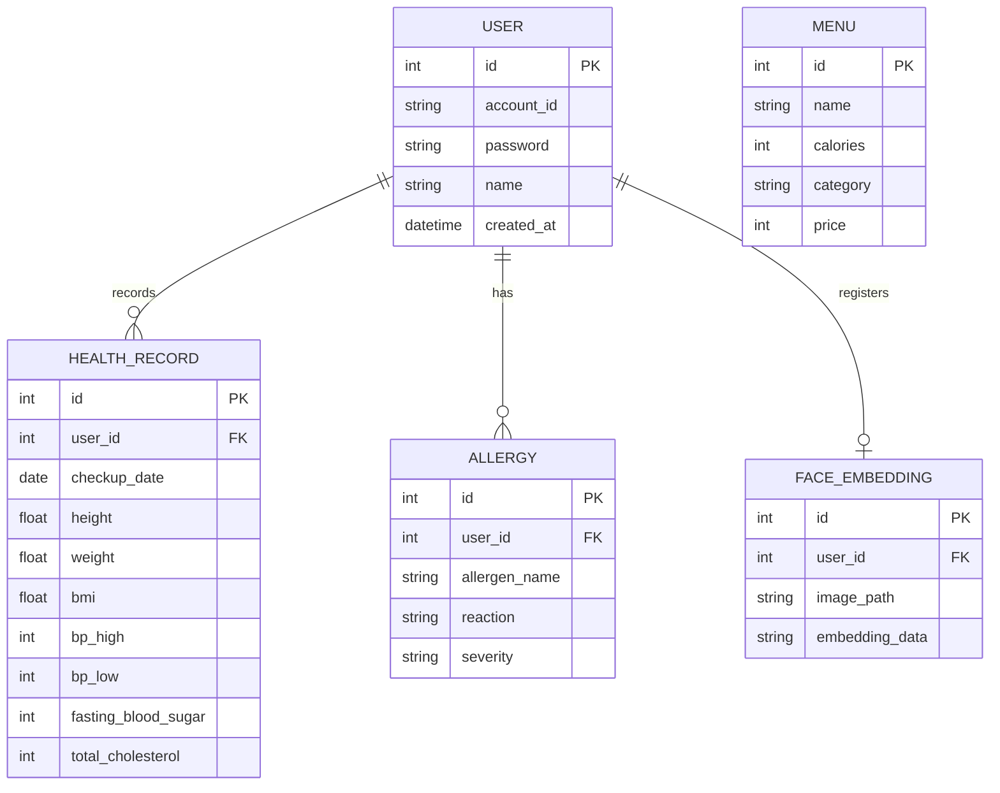

# Medi-Pass Frontend (API Server)

건강 맞춤형 메뉴 추천 키오스크의 사용자 인터페이스(User Interface) 프로젝트입니다.
React와 Vite로 개발되었으며, 웹캠을 이용한 얼굴 인식 로그인, 터치스크린에 최적화된 메뉴 주문 경험을 제공합니다.

## 🔗 관련 리포지토리 (Repositories)
이 프로젝트는 프론트엔드와 백엔드로 나뉘어 있습니다.
* **Frontend**: [health_kiosk_front 링크 바로가기](https://github.com/rkddlsxo/health_kiosk_front)
* **Backend**: [health_kiosk_back 링크 바로가기](https://github.com/rkddlsxo/health_kiosk_back)

## 👥 팀원 및 역할 (Team)
| 이름 | 역할 | GitHub | 담당 기능 |
|:---:|:---:|:---:|:---|
| **강인태** | 팀장 | [@rkddlsxo](https://github.com/rkddlsxo) | 프론트엔드, 백엔드 , AI요약 기능 |
| **김지웅** | 팀원 | [@wldnd7145](https://github.com/wldnd7145) | AI기능 전반, 백엔드 |
| **문규원** | 팀원 | [@moongyuxx](https://github.com/moongyuxx) | API 설계, 문서, UI/UX 디자인, 백엔드|

## 🛠 기술 스택 (Tech Stack)

* **Framework**: React
* **Build Tool**: Vite
* **Language**: JavaScript (JSX)
* **Styling**: CSS (App.css, index.css)
* **HTTP Client**: Fetch API (또는 Axios)

## 📂 프로젝트 구조 (Structure)

```text
health_kiosk_front/
├── src/
│   ├── components/     # 재사용 가능한 컴포넌트 (HealthAdvisor 등)
│   ├── pages/
│   │   ├── Main/       # 메인 랜딩 페이지
│   │   ├── User/       # 회원가입, 일반 로그인, 건강 설문(Survey)
│   │   ├── Kiosk/      # 얼굴 로그인, 메뉴 주문(Menu)
│   │   └── TotalSolutionPage.jsx # 종합 건강 리포트 및 추천 결과
│   ├── App.jsx         # 라우팅 설정
│   └── main.jsx        # 진입점
└── vite.config.js      # Vite 설정
```

### 🚀 설치 및 실행 방법 (Installation & Run)

``` Bash
1. 프로젝트 클론 및 의존성 설치
Node.js가 설치되어 있어야 합니다.

# 의존성 설치
npm install
2. 실행 (Development Mode)
개발 모드로 실행합니다.

npm run dev
브라우저에서 http://localhost:5173 (포트는 설정에 따라 다를 수 있음)으로 접속합니다.

3. 백엔드 연결 설정
백엔드 API 서버(http://127.0.0.1:8000)가 실행 중이어야 정상적으로 데이터를 받아올 수 있습니다. API 호출 경로는 코드 내에서 관리되거나 .env 파일을 통해 설정할 수 있습니다.
```

주의: 얼굴 인식 기능을 사용하기 위해 브라우저의 카메라 권한 허용이 필요합니다.

### 📱 주요 화면 및 기능
메인 화면 (Main): 서비스 소개 및 시작하기.

로그인/회원가입:

일반 회원가입 및 건강 설문(알러지, 지병 등) 조사.

키오스크 모드에서 얼굴 인식 로그인(Face Login) 지원.

메뉴 주문 (Menu):

전체 메뉴 조회.

사용자 데이터 기반 위험 메뉴 경고 (알러지 유발 등).

건강 솔루션 (Total Solution):

AI가 분석한 사용자 맞춤형 식단 가이드 제공.

## 📊 데이터 모델 설계 (Data Schema)

### 1. 사용자 및 인증 (User & Auth)
| 구분 | 클래스명 | 주요 필드 | 설명 |
| :--- | :--- | :--- | :--- |
| **Request** | `UserCreate` | `account_id`, `password`, `name` | 회원가입 요청 데이터 |
| **Request** | `LoginRequest` | `account_id`, `password` | 로그인 요청 데이터 |
| **Response** | `LoginResponse` | `success`, `message`, `user_id`, `user_name` | 로그인 성공 결과 및 유저 정보 |

### 2. 건강 및 알러지 (Health & Allergy)
| 구분 | 클래스명 | 주요 필드 | 설명 |
| :--- | :--- | :--- | :--- |
| **Request** | `UserHealthCreate` | `height`, `weight`, `bp_high`, `fasting_blood_sugar` 등 | 건강검진 데이터 수동 입력 |
| **Response** | `UserHealthResponse` | `id`, `user_id`, `bmi`, `ast`, `alt` 등 | 등록된 건강 데이터 조회 |
| **Request** | `UserAllergyCreate` | `allergen_name`, `reaction`, `severity` | 알러지 유발 물질 및 증상 등록 |

---

## 🔌 API 명세 (API Specification)

### 1. 유저 및 인증 (User & Auth)
| 기능 | 메서드 | 엔드포인트 | 설명 |
| :--- | :---: | :--- | :--- |
| 회원가입 | `POST` | `/api/users/register` | 일반 계정 회원가입 |
| 로그인 | `POST` | `/api/users/login` | 계정 ID/PW 기반 로그인 |
| 로그아웃 | `POST` | `/api/users/logout` | 세션 종료 및 키오스크 로그아웃 |
| 얼굴 등록 | `POST` | `/api/users/{account_id}/face` | 사진 업로드 및 얼굴 임베딩 저장 |
| 사용자 조회 | `GET` | `/api/users/{account_id}` | 메인 화면용 유저 프로필 조회 |

### 2. 건강 데이터 자동/수동 등록 (Health Data)
| 기능 | 메서드 | 엔드포인트 | 설명 |
| :--- | :---: | :--- | :--- |
| 건강검진 스캔 | `POST` | `/api/users/{id}/health/scan` | **AI OCR**: 검진표 이미지 자동 분석 및 저장 |
| 알레르기 스캔 | `POST` | `/api/users/{id}/allergies/scan` | **AI OCR**: 알레르기 서류 자동 분석 및 저장 |
| 건강정보 등록/수정 | `POST`/`PUT` | `/api/users/{id}/health` | 건강 데이터 직접 입력 및 업데이트 |
| 알레르기 등록 | `POST` | `/api/users/{id}/allergies` | 알러지 정보 직접 입력 |

### 3. 키오스크 및 AI 기능 (Kiosk & AI)
| 기능 | 메서드 | 엔드포인트 | 설명 |
| :--- | :---: | :--- | :--- |
| 키오스크 얼굴 인증 | `POST` | `/api/kiosk/detect-face` | 키오스크 카메라를 통한 실시간 인증 |
| 메뉴 데이터 조회 | `GET` | `/api/menus` | 전체 키오스크 메뉴 목록 불러오기 |
| AI 메뉴 추천 | `POST` | `/api/recommend/menu` | **Gemini**: 사용자 맞춤형 식단 큐레이션 |


## ERD



User (사용자): 시스템의 중심 엔티티입니다. account_id로 식별하며, 여러 개의 건강 기록과 알러지 정보를 가질 수 있습니다.

Health_Record (건강 검진): 사용자의 신체 수치를 저장합니다. (1:N 관계) 시간의 흐름에 따른 건강 변화를 추적하기 위해 여러 레코드를 가질 수 있도록 설계되었습니다.

Allergy (알러지): 사용자가 가진 알러지 유발 물질들을 저장합니다. (1:N 관계)

Face_Embedding (얼굴 데이터): 얼굴 인식 로그인을 위해 추출된 수치화된 벡터 데이터를 저장합니다.

Menu (메뉴): 추천의 대상이 되는 음식 데이터입니다. Gemini AI가 사용자의 Health_Record 및 Allergy와 비교하여 최적의 메뉴를 선별합니다.


